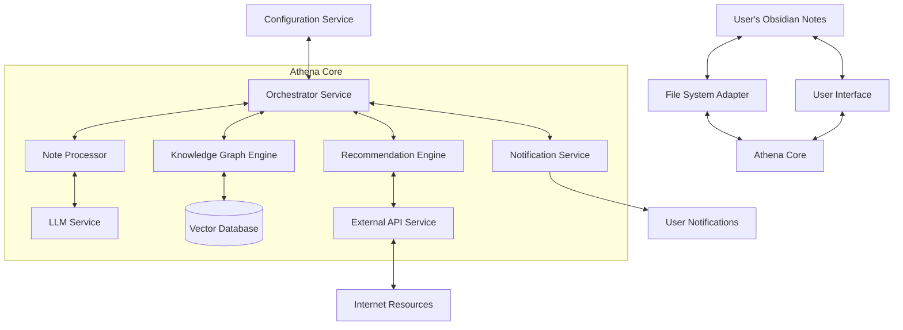
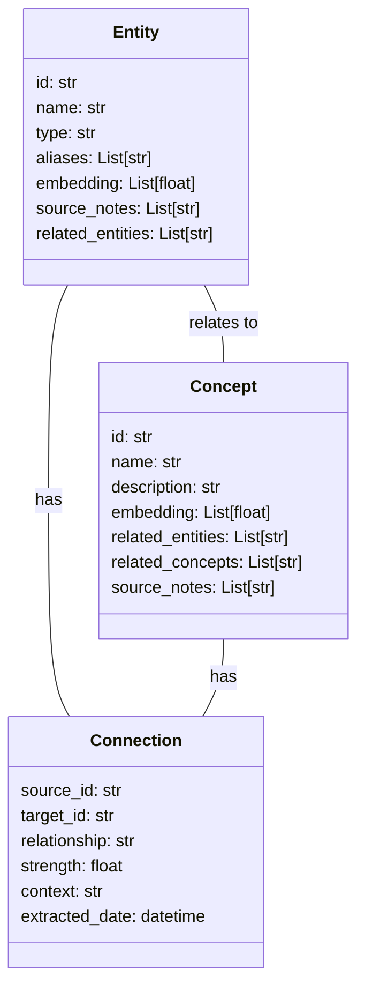
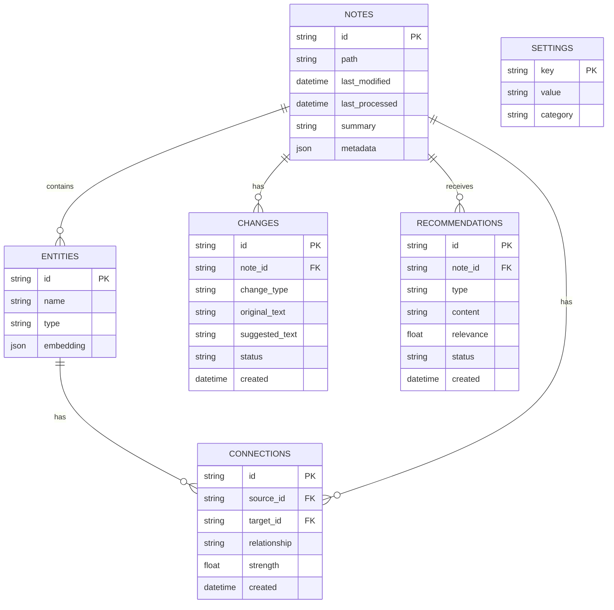
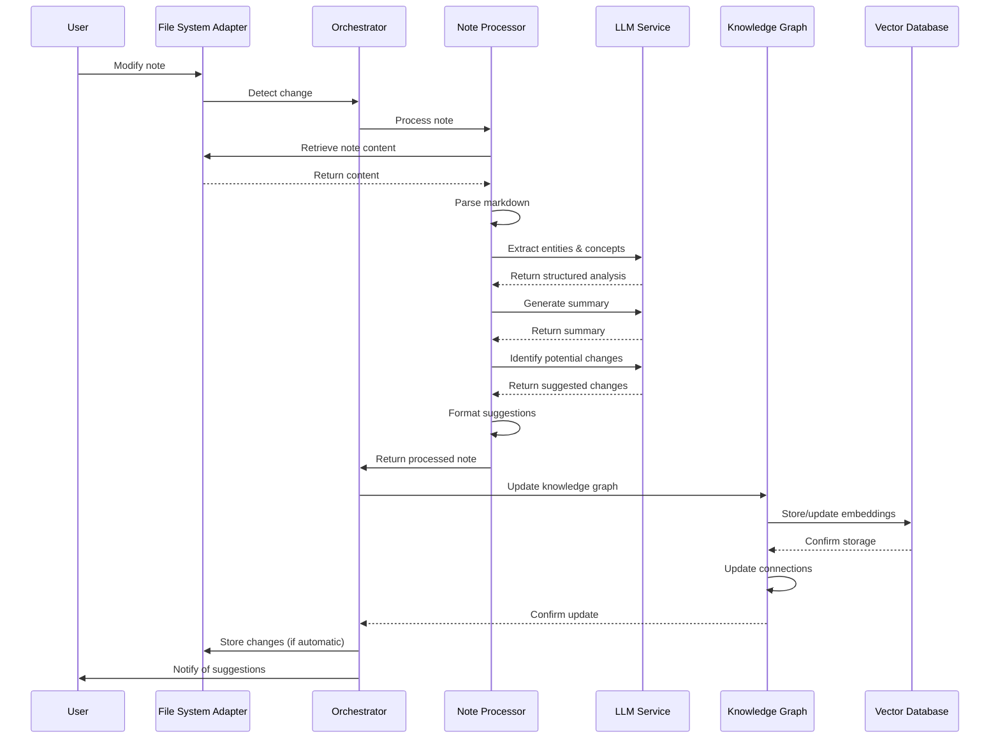
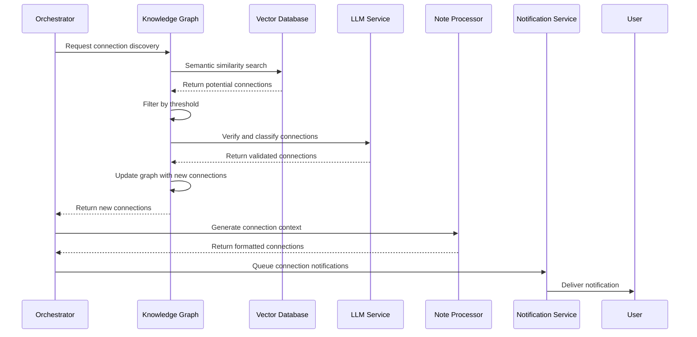
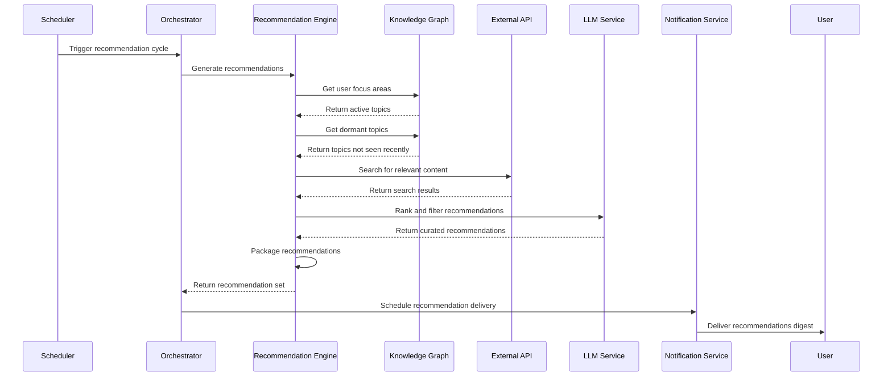
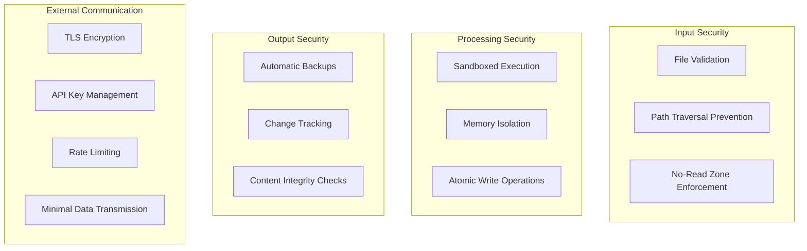
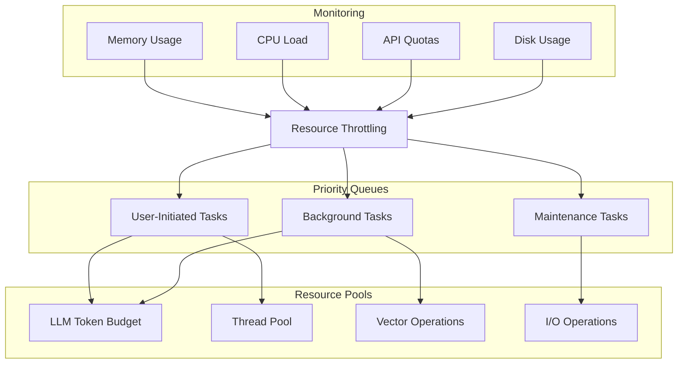
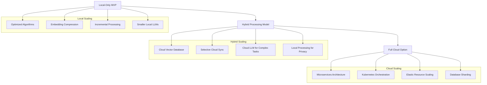

# Athena: Technical Architecture Document

## 1. Executive Summary

This document outlines the technical architecture for Athena, an AI-powered knowledge management assistant designed to help users organize, clean, and enrich their Obsidian markdown notes. The architecture balances immediate MVP delivery capabilities with a foundation for future scalability and feature expansion.

Athena employs a modular design with specialized services for note processing, knowledge graph management, recommendation generation, and user interaction. The core intelligence is powered by large language models (LLMs) with vector embeddings for semantic understanding, orchestrated through a context-aware agent framework.

## 2. System Architecture Overview

Athena follows a hybrid architecture pattern combining:
- Local-first processing for privacy and performance
- Agent-based design for autonomous operations
- Event-driven architecture for asynchronous processing
- Microservices for scalability and maintainability

### 2.1 High-Level Architecture Diagram



### 2.2 Core Design Principles

1. **Privacy-First**: Local processing whenever possible, with explicit user consent for cloud features
2. **Non-Destructive**: All AI modifications clearly marked and original content preserved
3. **Extensible**: Modular design allowing for new capabilities to be added without core changes
4. **Intelligent**: Leveraging state-of-the-art LLMs and vector semantics for true understanding
5. **Autonomous**: Designed to operate with minimal user intervention while respecting boundaries

## 3. Component Architecture

### 3.1 Athena Core Components

#### 3.1.1 Orchestrator Service

The central coordinator managing the interaction between all components.

**Responsibilities:**
- Request routing and component coordination
- Session context management
- Operation scheduling and prioritization
- Telemetry and monitoring
- Error handling and recovery

**Technologies:**
- Python 3.11+
- Redis for shared context/state management
- APScheduler for task scheduling

#### 3.1.2 Note Processor

Handles parsing, analysis, and modification of markdown files.

**Responsibilities:**
- Markdown parsing and validation
- Content cleaning and formatting
- Structure analysis and recommendations
- Backlink management
- Diff generation for suggested changes

**Technologies:**
- Python-Markdown for parsing
- DiffLib for generating differences
- Spacy for basic NLP tasks
- Custom markdown AST manipulator

#### 3.1.3 Knowledge Graph Engine

Creates and maintains the semantic network between notes and concepts.

**Responsibilities:**
- Entity and concept extraction
- Relationship identification
- Graph construction and maintenance
- Similarity and connection queries
- Historical pattern recognition

**Technologies:**
- NetworkX for graph data structures
- Qdrant or Milvus for vector database (local deployment)
- FAISS for similarity search acceleration

#### 3.1.4 Recommendation Engine

Generates intelligent suggestions for content, organization, and connections.

**Responsibilities:**
- Content relevance scoring
- External resource discovery
- Old content resurfacing
- Organization suggestion generation
- Priority-based recommendation queuing

**Technologies:**
- Custom recommendation algorithms
- LangChain for LLM prompt engineering
- BeautifulSoup and Trafilatura for web content extraction

#### 3.1.5 LLM Service

Provides natural language intelligence capabilities to all components.

**Responsibilities:**
- Text analysis and understanding
- Content generation and modification
- Summarization and extraction
- Query interpretation
- Context-aware processing

**Technologies:**
- OpenAI API (GPT-4) for MVP
- Anthropic Claude API as alternative
- Instructor framework for structured outputs
- Local embeddings generation (SentenceTransformers)

#### 3.1.6 Notification Service

Manages communication with the user about suggestions and changes.

**Responsibilities:**
- Notification formatting and prioritization
- Delivery channel management
- User preference adherence
- Feedback collection
- Suggestion tracking

**Technologies:**
- Custom Python notification framework
- Email via SMTP
- Desktop notifications via platform-specific APIs
- Future: mobile notifications via webhook integrations

#### 3.1.7 Configuration Service

Handles user preferences, system settings, and feature toggles.

**Responsibilities:**
- Configuration storage and retrieval
- Setting validation
- Default management
- Secure credential storage
- Feature flag management

**Technologies:**
- ConfigParser with encryption for sensitive values
- JSON schema for validation
- Keyring for OS-level secure storage

### 3.2 Integration Components

#### 3.2.1 File System Adapter

Provides secure access to the user's Obsidian notes.

**Responsibilities:**
- File reading and writing with proper encoding
- Change detection and monitoring
- Backup management
- Atomic write operations
- Directory traversal respecting exclusions

**Technologies:**
- Watchdog for file system monitoring
- FSSpec for abstracted file operations
- Shutil for backup operations

#### 3.2.2 External API Service

Manages interactions with internet resources and external services.

**Responsibilities:**
- Rate limiting and caching
- Authentication management
- Request normalization
- Response parsing
- Error handling and retries

**Technologies:**
- HTTPX for async HTTP requests
- Tenacity for retry logic
- SQLite for response caching
- Pydantic for data validation

#### 3.2.3 User Interface

Provides user controls and visualization for Athena.

**MVP Approach:**
- Command-line interface for initial implementation
- Simple web dashboard for visualization
- System tray application for notifications

**Future Development:**
- Obsidian plugin integration
- Native desktop application
- Mobile companion app

**Technologies:**
- CLI: Typer or Click
- Web Dashboard: FastAPI + React
- System Tray: Pystray or equivalent

## 4. Data Architecture

### 4.1 Core Data Structures

#### 4.1.1 Note Model

```python
class Note:
    id: str                     # Unique identifier (file path hash)
    path: str                   # File system location
    content: str                # Raw markdown content
    metadata: Dict              # Frontmatter and extracted metadata
    last_modified: datetime     # Last modification timestamp
    last_processed: datetime    # Last Athena processing timestamp
    embeddings: Dict[str, List[float]]  # Section-level vector embeddings
    entities: List[Entity]      # Extracted named entities
    summary: str                # AI-generated summary
    suggested_changes: List[Change]  # Pending modifications
    tags: List[str]             # Extracted and suggested tags
    connections: List[Connection]  # Relationships to other notes
```

#### 4.1.2 Knowledge Graph Structure



#### 4.1.3 Change Tracking Model

```python
class Change:
    id: str                     # Unique identifier
    note_id: str                # Associated note
    timestamp: datetime         # When change was suggested
    change_type: str            # Type of change (typo, format, link, etc.)
    original_text: str          # Text before change
    suggested_text: str         # Text after change
    context: str                # Surrounding content
    location: Location          # Position in document
    reason: str                 # Explanation for change
    status: str                 # pending, applied, rejected
    confidence: float           # LLM confidence score
```

### 4.2 Storage Strategy

#### 4.2.1 Local Storage

**For MVP:**
- SQLite database for structured data
- Local file system for note content
- Local vector database (Qdrant/FAISS)
- Encrypted configuration files

**Database Schema (Simplified):**



#### 4.2.2 Future Cloud Extensions

- PostgreSQL for structured data
- S3-compatible storage for backups
- Managed vector database (Pinecone/Weaviate)
- Redis for caching and real-time features

## 5. Process Flows

### 5.1 Note Processing Pipeline



### 5.2 Connection Discovery Process



### 5.3 Recommendation Generation Flow



## 6. Technology Stack

### 6.1 Core Technologies

| Component | Technology | Rationale |
|-----------|------------|-----------|
| Programming Language | Python 3.11+ | Excellent ML/AI libraries, good text processing, cross-platform |
| LLM Framework | LangChain | Provides abstraction over multiple LLM providers |
| Vector Embeddings | SentenceTransformers | High-quality local embeddings generation |
| Vector Database | Qdrant (MVP), Pinecone (future) | Efficient similarity search, Qdrant works locally |
| Graph Database | NetworkX (MVP), Neo4j (future) | Efficient representation of knowledge relationships |
| Relational Database | SQLite (MVP), PostgreSQL (future) | Simple deployment for MVP, scalable for future |
| API Framework | FastAPI | High performance, automatic documentation, async support |
| Task Scheduling | APScheduler | Reliable Python-native scheduling |
| UI Framework | React + Tailwind CSS | Modern, component-based, responsive design |

### 6.2 External Services

| Service | Usage | Alternative |
|---------|-------|-------------|
| OpenAI API | Primary LLM provider | Self-hosted Llama 3 |
| Anthropic Claude API | Alternative LLM provider | - |
| SerpAPI | Web search capabilities | Custom scraper (limited) |
| HuggingFace Inference API | Specialized ML models | Local model deployment |

### 6.3 Development Tools

| Tool | Purpose |
|------|---------|
| Poetry | Dependency management |
| Docker | Containerization |
| Pytest | Testing framework |
| Ruff | Linting and formatting |
| GitHub Actions | CI/CD |
| Pre-commit | Code quality hooks |

## 7. Security Architecture

### 7.1 Data Protection

**Local Data:**
- Database encryption at rest
- Secure credential storage using OS keychain
- Restricted file permissions
- Local processing prioritized

**API Communications:**
- HTTPS for all external communications
- API key rotation
- Minimal data transmission

**User Privacy:**
- Configurable "no-read" zones
- Local LLM inference when possible
- Anonymized telemetry
- Transparent processing logs

### 7.2 Security Measures



## 8. Performance Considerations

### 8.1 Optimization Strategies

1. **Lazy Loading**
   - Process notes on-demand
   - Generate embeddings asynchronously
   - Defer non-critical operations

2. **Caching**
   - LRU cache for frequently accessed notes
   - Embedding cache to avoid regeneration
   - LLM response caching for similar queries

3. **Parallelization**
   - Multi-threading for I/O operations
   - Batch processing for LLM requests
   - Concurrent file system operations

4. **Incremental Processing**
   - Only process changed sections of notes
   - Delta updates to knowledge graph
   - Progressive enhancement of metadata

### 8.2 Resource Management



## 9. Scalability Approach

### 9.1 MVP Scalability

- Designed to handle up to 10,000 notes on standard hardware
- Intelligent processing prioritization
- Configurable resource limits
- Background processing for intensive operations

### 9.2 Future Scaling Paths



## 10. Implementation Roadmap

### 10.1 MVP Implementation (5-7 Days)

**Day 1-2: Core Infrastructure**
- Set up project structure and development environment
- Implement File System Adapter
- Create basic database schema
- Build Orchestrator service skeleton

**Day 2-3: Note Processing Engine**
- Develop markdown parser
- Implement basic cleaning functionality
- Create change suggestion mechanism
- Build summary generation

**Day 3-4: Knowledge Representation**
- Implement basic knowledge graph
- Build entity extraction pipeline
- Set up vector database
- Create connection discovery logic

**Day 5-6: User Interface and Integration**
- Develop notification system
- Create basic CLI interface
- Implement configuration service
- Build system tray application

**Day 7: Testing and Refinement**
- End-to-end testing
- Performance optimization
- Documentation
- Packaging for distribution

### 10.2 Post-MVP Priorities

1. Enhanced connection discovery
2. Web interface for visualization
3. External content recommendations
4. Improved knowledge graph algorithms
5. iCloud connectivity research

## 11. Technical Challenges and Mitigations

| Challenge | Risk Level | Mitigation Strategy |
|-----------|------------|---------------------|
| File system access across platforms | High | Use FSSpec for abstraction, platform-specific fallbacks |
| LLM cost management | Medium | Tiered approach: local embeddings, caching, quota management |
| Knowledge graph scalability | Medium | Incremental updates, pruning algorithms, hierarchical structure |
| User privacy concerns | High | Local-first approach, transparency, minimal data transmission |
| Handling large note collections | Medium | Lazy loading, prioritization, incremental processing |
| iCloud API limitations | High | Research alternatives, local sync as fallback, user-initiated sync |
| Maintaining note fidelity | High | Non-destructive modifications, explicit change tracking |

## 12. Appendix

### 12.1 API Specifications

#### Core Internal API

```typescript
// Note Processing API
interface NoteProcessor {
  processNote(noteId: string): Promise<ProcessedNote>;
  suggestChanges(noteId: string): Promise<Change[]>;
  applyChanges(noteId: string, changeIds: string[]): Promise<boolean>;
  generateSummary(noteId: string): Promise<string>;
}

// Knowledge Graph API
interface KnowledgeGraph {
  addNote(note: ProcessedNote): Promise<void>;
  findConnections(noteId: string): Promise<Connection[]>;
  getRelatedNotes(noteId: string, limit: number): Promise<NoteReference[]>;
  getTopConcepts(limit: number): Promise<Concept[]>;
  getNotesForConcept(conceptId: string): Promise<NoteReference[]>;
}

// Recommendation API
interface RecommendationEngine {
  generateRecommendations(userId: string): Promise<Recommendation[]>;
  getRecommendationsByType(type: RecommendationType): Promise<Recommendation[]>;
  markRecommendationStatus(id: string, status: Status): Promise<void>;
}
```

#### External API (Future)

```typescript
// REST API for potential integrations
interface AthenaAPI {
  // Note Management
  getNotes(): Promise<NoteMetadata[]>;
  getNoteById(id: string): Promise<Note>;
  
  // Knowledge Graph
  getConnections(noteId: string): Promise<Connection[]>;
  getTopConcepts(): Promise<Concept[]>;
  
  // Recommendations
  getRecommendations(): Promise<Recommendation[]>;
  
  // Configuration
  getSettings(): Promise<Settings>;
  updateSettings(settings: SettingsUpdate): Promise<Settings>;
}
```

### 12.2 Sample Configuration

```yaml
# Athena Configuration

system:
  data_directory: "~/.athena"
  log_level: "INFO"
  max_threads: 4
  backup_enabled: true
  backup_count: 5

privacy:
  no_read_folders:
    - "Private"
    - "Journal"
  external_api_enabled: true
  telemetry_level: "minimal"  # none, minimal, full

obsidian:
  vault_path: "~/Documents/Obsidian/MainVault"
  watch_changes: true
  auto_apply_changes: false

llm:
  provider: "openai"  # openai, anthropic, local
  model: "gpt-4"
  temperature: 0.2
  max_tokens_per_request: 4000
  token_budget_daily: 100000

notifications:
  frequency: "daily"  # realtime, hourly, daily, weekly
  channels:
    desktop: true
    email: false
  email_address: ""
  quiet_hours:
    enabled: true
    start: "22:00"
    end: "08:00"

features:
  note_cleaning:
    enabled: true
    fix_typos: true
    format_markdown: true
    add_summaries: true
    suggest_backlinks: true
  
  connections:
    enabled: true
    discovery_threshold: 0.75
    max_suggestions_per_day: 5
  
  recommendations:
    enabled: true
    external_content: true
    old_note_resurfacing: true
    trusted_domains:
      - "arxiv.org"
      - "wikipedia.org"
      - "github.com"
```

---

*This technical architecture document serves as the blueprint for implementing the Athena knowledge management assistant, providing a comprehensive guide for development while ensuring the system meets all functional and non-functional requirements specified in the PRD.*
